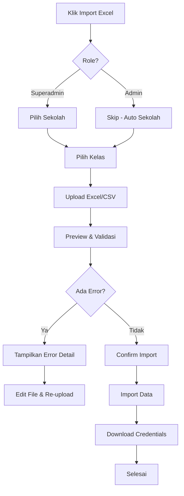

# Dokumentasi Fitur Import/Export Excel untuk Guru & Siswa

## 📋 Overview

Fitur ini memungkinkan admin dan superadmin untuk melakukan bulk import data guru dan siswa menggunakan file Excel/CSV, serta export data yang sudah ada ke format Excel.

## 🎯 Features

### 1. **Import Data (Bulk Upload)**

- Import guru/siswa dari Excel/CSV
- Validasi data sebelum import (preview mode)
- Auto-generate password format: `nama[0] + 123`
- Export file credentials hasil import
- Support hingga 500 baris per file
- Multi-class assignment untuk guru

### 2. **Export Data**

- Export data guru/siswa ke Excel
- Format rapi dan siap diedit
- Include semua data: NIP/NISN, nama, email, kelas, dll

### 3. **Template Download**

- Download template Excel dengan format yang benar
- Include contoh data untuk referensi
- Format kolom otomatis disesuaikan

## 🔐 Role Access

### **Superadmin:**

- Harus pilih **Sekolah** dahulu
- Pilih **Kelas** (single untuk siswa, multi untuk guru)
- Upload file Excel/CSV
- Import & Export

### **Admin:**

- Sekolah otomatis (sesuai sekolah admin)
- Pilih **Kelas** (single untuk siswa, multi untuk guru)
- Upload file Excel/CSV
- Import & Export

## 📝 Format Template

### **Template Guru** (`template_guru.xlsx`)

| Kolom         | Tipe  | Required | Format                | Contoh             |
| ------------- | ----- | -------- | --------------------- | ------------------ |
| nama_lengkap  | Text  | ✅       | String                | Ahmad Santoso      |
| email         | Email | ✅       | email@domain.com      | ahmad@example.com  |
| nip           | Text  | ✅       | 18 digit              | 198501012010011001 |
| jenis_kelamin | Text  | ✅       | laki-laki / perempuan | laki-laki          |
| tanggal_lahir | Date  | ❌       | YYYY-MM-DD            | 1985-01-01         |
| alamat        | Text  | ❌       | String                | Jl. Merdeka No. 10 |

### **Template Siswa** (`template_siswa.xlsx`)

| Kolom         | Tipe  | Required | Format                | Contoh            |
| ------------- | ----- | -------- | --------------------- | ----------------- |
| nama_lengkap  | Text  | ✅       | String                | Budi Santoso      |
| email         | Email | ✅       | email@domain.com      | budi@example.com  |
| nisn          | Text  | ✅       | 10 digit              | 0012345678        |
| jenis_kelamin | Text  | ✅       | laki-laki / perempuan | laki-laki         |
| tanggal_lahir | Date  | ❌       | YYYY-MM-DD            | 2010-05-15        |
| alamat        | Text  | ❌       | String                | Jl. Kenanga No. 5 |

## 🔄 Flow Import



## ✅ Validasi Data

### **Validasi Umum:**

1. Format file: `.xlsx` atau `.csv` only
2. Max file size: 10MB
3. Max rows: 500 per file
4. Email format valid
5. Email unique (belum terdaftar)
6. Jenis kelamin: `laki-laki` atau `perempuan`
7. Tanggal lahir format: `YYYY-MM-DD`

### **Validasi Guru:**

- NIP wajib diisi & unique
- NIP format 18 digit

### **Validasi Siswa:**

- NISN wajib diisi & unique
- NISN format 10 digit

### **Validasi Kelas:**

- Kelas exist di database
- Kelas belong to sekolah yang dipilih
- Guru bisa assign multiple kelas
- Siswa hanya 1 kelas

## 📊 Response Import

### **Success Response:**

```json
{
  "success": true,
  "data": {
    "totalRows": 30,
    "successCount": 27,
    "failedCount": 3,
    "successfulImports": [...],
    "failedImports": [
      {
        "rowNumber": 5,
        "data": {...},
        "errors": ["Email sudah terdaftar"]
      }
    ],
    "credentials": [...],
    "credentialsFile": "base64_encoded_xlsx"
  },
  "message": "Import selesai: 27 berhasil, 3 gagal"
}
```

## 🔑 Auto-Generated Password

Format: `nama_pertama + 123`

**Contoh:**

- `Ahmad Santoso` → password: `ahmad123`
- `Budi Wijaya` → password: `budi123`
- `Siti Nurhaliza` → password: `siti123`

## 📦 Export Features

### **Export Current Data:**

1. Klik tombol "Export Excel"
2. File akan di-download otomatis
3. Format: `export_guru_[timestamp].xlsx`
4. Include data sesuai filter yang aktif

### **Credentials Export:**

- Auto-download setelah import berhasil
- Format: `credentials_guru_[timestamp].xlsx`
- Berisi: nama, email, password, role, sekolah, kelas
- **PENTING:** Share ke user yang bersangkutan

## 🎨 UI Components

### **ImportModal Component:**

```tsx
<ImportModal
  isOpen={isImportModalOpen}
  onClose={() => setIsImportModalOpen(false)}
  role="guru" // or "siswa"
  onSuccess={loadUsers}
  userRole="superadmin" // or "admin"
  userSekolahId={user?.sekolahId}
/>
```

### **UserManagementTable Props:**

```tsx
<UserManagementTable
  ...
  onImport={handleImport}
  onExport={handleExport}
/>
```

## 🔧 API Endpoints

### **Backend Routes:**

```javascript
// Download template
GET /api/users/template/:role (guru/siswa)

// Preview import (validation only)
POST /api/users/import/preview
- Body: FormData { file, role, sekolah_id?, kelas_id?, kelas_ids? }

// Actual import
POST /api/users/import
- Body: FormData { file, role, sekolah_id?, kelas_id?, kelas_ids? }

// Export existing data
GET /api/users/export?role=guru&sekolah_id=xxx
```

## 📚 Dependencies

### **Backend:**

```json
{
  "xlsx": "^0.18.5",
  "csv-parser": "^3.0.0",
  "multer": "^2.0.2"
}
```

### **Frontend:**

```json
{
  "@mui/icons-material": "^7.3.4",
  "sweetalert2": "^11.26.3"
}
```

## 🐛 Error Handling

### **Common Errors:**

| Error                      | Cause                        | Solution                    |
| -------------------------- | ---------------------------- | --------------------------- |
| Format file tidak didukung | Upload file bukan .xlsx/.csv | Gunakan format yang benar   |
| Email sudah terdaftar      | Email duplicate              | Gunakan email lain          |
| NIP/NISN sudah terdaftar   | Identifier duplicate         | Cek data existing           |
| Kelas tidak ditemukan      | Kelas ID invalid             | Pilih kelas yang valid      |
| Maksimal 500 baris         | File terlalu besar           | Split menjadi beberapa file |

### **Error Display:**

- Row-by-row error detail
- Specific error message per field
- Preview mode untuk cek sebelum import
- Option: skip error rows atau cancel

## 🎯 Best Practices

### **Untuk Admin:**

1. Download template terlebih dahulu
2. Isi data sesuai format
3. Cek duplicate email/NIP/NISN
4. Pastikan jenis kelamin benar
5. Use preview mode untuk validasi
6. Simpan file credentials hasil import
7. Share credentials ke user

### **Untuk User:**

1. Max 500 rows per file
2. Jangan ubah header kolom
3. Format tanggal: YYYY-MM-DD
4. Email harus valid & unique
5. NIP 18 digit, NISN 10 digit
6. Backup data sebelum import

## 📱 Testing Checklist

- [ ] TC-124: Import Guru via Excel/CSV
- [ ] TC-125: Import Siswa via Excel/CSV
- [ ] TC-126: Import dengan File Format Salah
- [ ] TC-127: Import dengan Data Invalid
- [ ] TC-128: Download Template Import
- [ ] TC-129: Export Data Guru ke Excel
- [ ] TC-130: Export Data Siswa ke Excel
- [ ] Preview mode validation
- [ ] Multi-class assignment untuk guru
- [ ] Credentials auto-download
- [ ] Error handling per row
- [ ] File size limit
- [ ] Row limit (500)

## 🔗 Related Files

### **Backend:**

- `src/services/importExportService.js` - Core logic
- `src/controllers/userController.js` - API handlers
- `src/routes/userRoutes.js` - Route definitions

### **Frontend:**

- `src/components/user-management/ImportModal.tsx` - Import UI
- `src/components/user-management/UserManagementTable.tsx` - Table with buttons
- `src/app/(pages)/kelola-pengguna/guru/page.tsx` - Guru page
- `src/app/(pages)/kelola-pengguna/akun-murid/page.tsx` - Siswa page

## 💡 Tips

1. **Gunakan Preview Mode:** Selalu preview sebelum import untuk cek error
2. **Batch Import:** Split data besar menjadi beberapa file (max 500 rows)
3. **Backup Credentials:** Save file credentials hasil import
4. **Check Duplicate:** Pastikan email/NIP/NISN tidak duplicate
5. **Format Consistent:** Gunakan template yang disediakan

---

**Last Updated:** November 19, 2025
**Version:** 1.0.0
